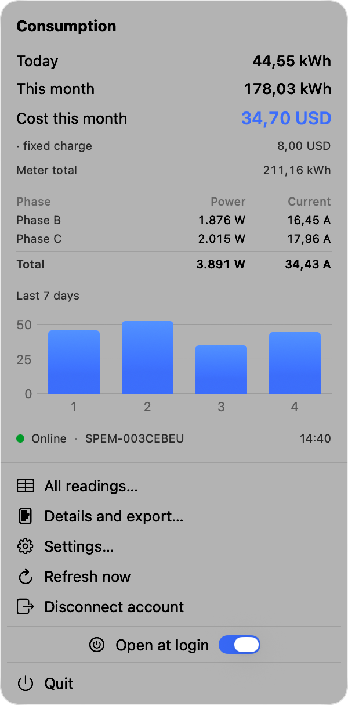

# Vatio

A macOS menu bar app that shows what your home is spending on electricity, and
what it costs, reading a Shelly energy meter through the Shelly cloud.

## What it does

- **This month's consumption and cost, always in the menu bar.**
- Power, current, voltage, power factor and frequency — **phase by phase** and
  in total.
- Daily consumption for the past week, and any date range with CSV export.
- **Your own tariff**: a single price per kWh or a tiered scale, with your
  currency, fixed charge and any surcharge above a given consumption.
- **Alerts that matter**: when the meter goes offline (usually a power cut) and
  when it comes back, saying how long it lasted; and when power, current,
  voltage or the month's consumption cross a limit you set — on the whole meter
  or on a single phase.

## Privacy

Vatio collects nothing. Your session is stored only on your Mac and the app
talks solely to the Shelly cloud. See [PRIVACY.md](PRIVACY.md).

## Support

Open an issue here, or write to leinieralvarez@gmail.com.

## Requirements

macOS 14 or later, a compatible Shelly energy meter and a Shelly cloud account.

---

Vatio is an independent application. It is not affiliated with, endorsed by or
sponsored by Shelly or Allterco Robotics.
